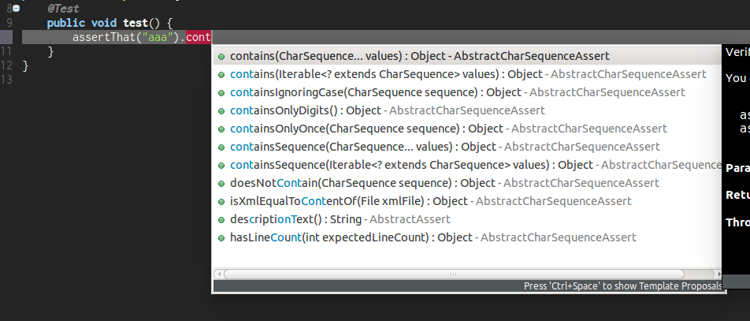
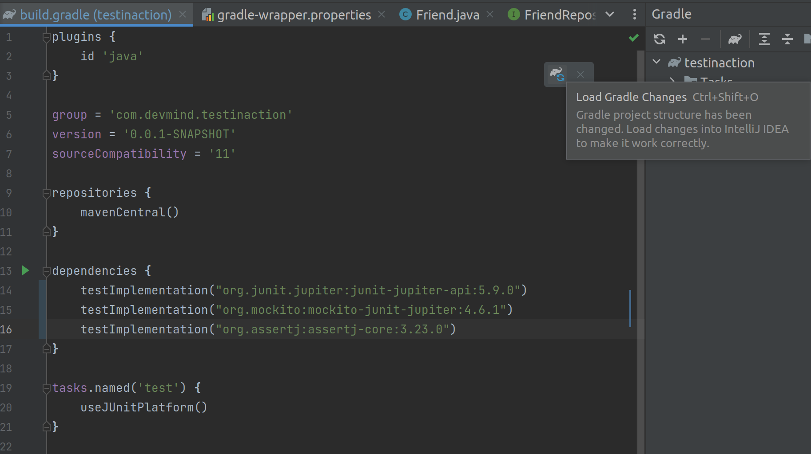

:doctitle: Write unit tests in Java (EN)
:description: Write unit tests in Java
:keywords: Java, Unit Test, AssertJ, Mockito, Junit
:author: Guillaume EHRET - Dev-Mind
:revdate: 2023-09-03
:category: Java
:teaser:  In this course you will learn how to write a unit test, how to simulate the collaborator behaviors and how to check the results
:imgteaser: ../../img/training/unit-tests.png
:toc:
:icons: font

In this course you will learn how to write a unit test, how to simulate the collaborator behaviors and how to check the results


== Software testing

=== Why do we need testing ?

Software testing is very important when you create an application, because it

* checks if the actual results match the expected results
* helps to identify errors by testing limits
* helps to not reproduce errors : when a bug occurs, we create a new test case, we fix the bug.. And after each code update, we execute this tests to know if the bug won't occur anymore#
* helps to know how your code works : tests are often the best documentation to understand how a piece of source code works
* helps you be more confident when you need to evolve your code: if you have good code coverage by testing, you will identify regressions quickly

=== Why do we need to automate testing ?

You can test your software manually

* but you have to do that before each feature update
* and more your application is rich more you need to do more tests

The solution is *to have automatic tests* and code them

Manual tests are cheaper on short-term but more expensive on long-term

Automated tests are expensive on short-term but cheaper on long-term

A human will tire when he has to execute the same tests continuously. He will be less conscientious and less attentive. It's not the case for a test program

image::../../img/training/unit-test/systemrobot.png[width=800, align="center"]

=== What are the different types of tests ?

You have different types of tests

* *Installation testing*: A software is often a set of little apps (web app, spring boot app, datasource....). This kind of test helps to check if your installation procedure is correct and if the software can be used
* *Security testing*: Checks the security and if your data keep confidential and not available from hackers
* *Performance testing*: to determine how a system or sub-system performs in terms of responsiveness and stability under a particular workload
* *End to end testing*: You test your app as a user. These tests are sometimes called functional tests
* *Unit testing*: We test every units of source code (each class, each methods...).
* ...

=== How to facilitate the writing of tests?

> If you are having trouble writing tests, *your code can/must be improved*. Good code is easily testable code.


If you want to facilitate your tests you can apply several rules

* use *interface* to define the contract to code and to test.
* when using an object language, it is easy to distribute responsibilities among several classes. Avoid centralizing all your code in a single service class. The less code a class has, the easier it will be to test.
* use *dependency injection*. This mechanism helps to use for example
** a mock object, to simulate the object behavior in a test and
** the real implementation in production code

== Unit tests

A unit test is a method that instantiates a small portion of your application (one method for example) and checks its behavior independently from other parts.

Portion to test, can be viewed as an independent system.We talk about System Under Test (SUT)

image::../../img/training/unit-test/test1.png[width=800, align="center"]

We are going to take an example with a service interface.

[source,java,subs="specialchars"]
----
public interface FriendService {
   /**
    * Compute friend age from his birth year
    */
   int computeFriendAge(Friend friend);
}
----

The service implementation is this one

[source,java, subs="specialchars"]
----
public class FriendServiceImpl implements FriendService {
    @Override
    public int computeFriendAge(Friend friend) {
        if(friend == null) {
            throw new IllegalArgumentException("Friend is required");
        }
        return LocalDate.now().getYear() - friend.getBirthYear();
    }
}
----

When you write a test you have to test all the cases. In our example you have to check when the user is null and when a user is defined and has a birth year.

In an application this SUT (System Under Test) will interact with other components

image::../../img/training/unit-test/test2.png[width=800, align="center"]

These other components are called collaborators.

image::../../img/training/unit-test/test4.png[width=800, align="center"]

For example if we change our service

[source,java, subs="specialchars"]
----
public class FriendServiceImpl implements FriendService {

    private FriendRepository friendRepository;
    private IntegerComputer integerComputer;

    public FriendServiceImpl(FriendRepository friendRepository,
                             IntegerComputer integerComputer) {
        this.friendRepository = friendRepository;
        this.integerComputer = integerComputer;
    }


    // ...
}
----

`FriendRepository` and `IntegerComputer` are 2 collaborators.


When you want to write a test of your SUT, you need to simulate the collaborator behaviors.


To simulate collabators, you have several possibilities

* *Use a fake object*: You create an object only for your test (it's not the best solution)
* *Use a spy object*: You create a spy from the real implementation of one collaborator. You use a library for that, and you can override the returned values
* *Use a mock object*: A mock is created via a library from a specified contract (an interface). And you can pre preprogram these objects to return your wanted values during the test


== Black box

When you want to write a test you have to consider this SUT (system under test) as a black box.

image::../../img/training/unit-test/test6.png[width=800, align="center"]

The code to test is not important, it's the black box... you have to focus on inputs and outputs

image::../../img/training/unit-test/test7.png[width=800, align="center"]

Your black box can have inputs (method parameters for example) : in your test you will invoke the SUT and you test this one by sending inputs

Your black box can return a result or update the system state (we have an output) : in your test you will check the result and assert if this result is equals to the expected behavior

When you write you can follow a pattern

* AAA : arrange /act /assert
* Behavior-Driven Development : Given / When / Then#
* ...

image::../../img/training/unit-test/test8.png[width=800, align="center"]

== Junit
https://junit.org/junit5/[Junit] is a framework to develop and execute unit tests in Java. https://junit.org/junit5/[Junit] is used to automate test execution.

https://junit.org/junit5/[Junit] allows you to separate the source code of the class from the code used to test it.


Test cases are grouped into Java classes that contain one or more test methods. Test cases can be executed individually or as test suites.

These test cases perform the following tasks:

1. *Arrange* : creation of an instance of the class and any other object necessary for the tests (prepare inputs)
2. *Act* : call of the method to be tested
3. *Assert* : comparison of the expected result with the obtained result (output): in case of failure, an exception is raised


[source,java,subs="specialchars"]
----
package com.devmind.unitests.friend;

import org.junit.jupiter.api.Assertions;
import org.junit.jupiter.api.BeforeEach;
import org.junit.jupiter.api.Test;

import java.time.LocalDate;

class FriendServiceImplTest {

    private FriendService friendService;

    @BeforeEach // 1.
    public void init() {
        friendService = new FriendServiceImpl();
    }

    @Test // 2.
    public void computeFriendAge() {
        // Arrange
        LocalDate birthday = LocalDate.parse("1978-06-09");
        Friend friend = new Friend(birthday, "Bellamy");

        // Act
        int age = friendService.computeFriendAge(friend);

        // Assert
        Assertions.assertEquals(45, age); // 3.
    }

    @Test
    public void computeFriendAgeWithNullFriendShouldFail() { // 4.
        Assertions.assertThrows(IllegalArgumentException.class, () -> friendService.computeFriendAge(null));
    }
}
----

1. Method annotated with @BeforeEach is executed before each tests (a @AfterEach exists)
2. Method annotated with @Test is a unit test method. We write a method for each test case
3. We use Assertions object provided by Junit to write assertions. Later we will use the object of another library, assertJ
4. We expect an exception when friend is null. It's important to use an explicit test method name

== Assertions

Assertions methods provided by Junit are not very readable. We prefer to use the https://assertj.github.io/doc/[AssertJ] library

https://assertj.github.io/doc/[AssertJ] provides a fluent API and with this API you always use the method `asserThat`

[source,java, subs="specialchars"]
----
Assertions.assertThat(age).isEqualTo(45);
Assertions.assertThat(name).isEqualTo("Bellamy");
----

With assertJ you can test the exception thrown by a method, its type, its message

[source,java,subs="specialchars"]
----
Assertions.assertThatThrownBy(() -> friendService.computeFriendAge(null))
                .isExactlyInstanceOf(IllegalArgumentException.class)
                .hasMessage("Friend is required");
----

If your expected result is a list of friends

[source,java, subs="specialchars"]
----
List<Friend> myFriends = Arrays.asList(
                new Friend("Elodie", 1999),
                new Friend("Charles", 2001));
----
you can check the content of this list

[source,java, subs="specialchars"]
----
Assertions.assertThat(myFriends)
                  .hasSize(2)
                  .extracting(Friend::getName)
                  .containsExactlyInAnyOrder("Elodie", "Charles");

Assertions.assertThat(myFriends)
          .hasSize(2)
          .extracting(Friend::getName, Friend::getBirthYear)
          .containsExactlyInAnyOrder(
                  Tuple.tuple("Elodie", 1999),
                  Tuple.tuple("Charles", 2001));
----

AssertJ is IDE friendly and its fluent API can be discovered by completion



You can find more informations on the official website https://assertj.github.io/doc/

== Mockito

We will use https://static.javadoc.io/org.mockito/mockito-core/2.23.0/org/mockito/Mockito.html[Mockito] to simulate collaborators behaviors.

https://static.javadoc.io/org.mockito/mockito-core/2.23.0/org/mockito/Mockito.html[Mockito] is a popular mock framework which can be used in conjunction with JUnit.

https://static.javadoc.io/org.mockito/mockito-core/2.23.0/org/mockito/Mockito.html[Mockito] allows you to create and configure mock objects. Using Mockito simplifies the development of tests for classes with external dependencies significantly.

Our `FriendServiceImpl` will use a collaborator to manage the friends `friendRepository`.


[source,java, subs="specialchars"]
----
public class FriendServiceImpl implements FriendService {

    private FriendRepository friendRepository; // 1.

    public FriendServiceImpl(FriendRepository friendRepository) { // 2.
        this.friendRepository = friendRepository;
    }

    @Override
    public double computeFriendAgeAverage() {
        List<Friend> friends = friendRepository.findAll();
        return friends.stream().collect(Collectors.averagingInt(this::computeFriendAge));
    }

    // ...
}
----

In this code we use `friendRepository`. You have to declare it as a property (1), and declare a constructor to inject an implementation (2)

In `FriendServiceImplTest` we will use Mockito to simulate `FriendRepository` and create the class to test `FriendServiceImpl`

<<<

[source,java, subs="specialchars"]
----
@ExtendWith(MockitoExtension.class) // 1.
class FriendServiceTest {

    @Mock // 2.
    private FriendRepository friendRepository;
    private FriendService friendService;

    @BeforeEach
    void init() { // 3.
        friendService = new FriendServiceImpl(friendRepository);
    }

    @Test
    void computeFriendAgeAverage() {
        // Arrange
        List<Friend> myFriends = List.of(
                new Friend(LocalDate.of(1999, 1, 1), "Elodie"),
                new Friend(LocalDate.of(2001, 1, 1), "Charles")
        );
        Mockito.when(friendRepository.findAll()).thenReturn(myFriends); // 4.

        // Act
        double average = friendService.computeFriendAgeAverage(); // 5.

        // Assert
        Assertions.assertThat(average).isEqualTo(22.0);
    }
}
----

<<<
1. We use `MockitoExtension`. This extension is able to manage annotations `@Mock`
2. Property annotated with `@Mock` will be generated by Mockito. Mockito create a mock (each collaborator have to be defined as mocks). You can define a mock behavior on a test
3. We use an init method to create the class to test and inject inside the mocks
4. You can define the mock object behavior in your test. Here, we want the mock will return a list of friends
5. You can call your SUT and check the result

Mockito allows to configure the returned values. If you don't specify the mock behavior, the mock will return

* null for objects
* 0 for numbers
* false for boolean
* empty collections for collections

You can also return an exception in place of a value. For example

[source,java, subs="specialchars"]
----
Mockito.when(friendRepository.findAll()).thenThrow(new IllegalArgumentException("Error"));
----

I won't talk about several features of Mockito, but you can read the official documentation to know how

1. https://static.javadoc.io/org.mockito/mockito-core/2.23.0/org/mockito/Mockito.html#13[Create a Spy] a real object and override its behavior
2. https://static.javadoc.io/org.mockito/mockito-core/2.23.0/org/mockito/Mockito.html#4[Verify] that a mock was called (it's sometimes usefull when you want to check if a void method was called)
3. other use cases on https://static.javadoc.io/org.mockito/mockito-core/2.23.0/org/mockito/Mockito.html


== icon:flask[] Unit tests

Use Git to clone the following project in a folder in your workspace. Use a terminal and launch this command if you use basic auth in Github

```
git clone https://github.com/Dev-Mind/unitTestInAction.git
```

If you use a SSH key launch

```
git clone git@github.com:Dev-Mind/unitTestInAction.git
```

This project is a https://dev-mind.fr/training/gradle/gradle.html[Gradle] project. You can open it in IntelliJ and configure it as we explained in the last course lecture.

In this lab we want to create a class to test the `FriendService` contract. Open the interface `FriendService` and its implementation `FriendServiceImpl`.

This service use a collaborator to load the friend list. This collaborator is `FriendRepository` and for the moment we have no implementation for this class. It's not a problem to write a test, because as this collaborator is injected via a constructor and as we know the collaborator contract, we will use Mockito to inject a mock object in place of the real one in the class to test.

We're going to update the Gradle configuration to load libraries needed to write the tests.

Open the file `build.gradle` and add these dependencies

----
dependencies {
    implementation("org.springframework:spring-context-support:6.0.11")
    testImplementation("org.junit.jupiter:junit-jupiter-api:5.10.0")
    testRuntimeOnly("org.junit.jupiter:junit-jupiter-engine:5.10.0")
    testImplementation("org.mockito:mockito-junit-jupiter:5.4.0")
    testImplementation("org.assertj:assertj-core:3.24.2")
}
----

You need to refresh your project to update the dependencies in IntelliJ. You can click on the button which appears in your file `build.gradle.kts` when your Gradle synchronisation is not up to date.



Or you can open the Gradle tab in IntelliJ to reload the configuration


Go on `FriendServiceImpl` and generate a test class with `Ctrl` + `Shift` + `T`

image::../../img/training/unit-test/generate-test.png[width=600, align="center"]

Write the tests to check the methods `computeFriendAge` and `computeFriendAgeAverage`. You can read the previous chapter to know how to do that. The main steps are these ones

1. Add an annotation `@ExtendWith(MockitoExtension.class)` to be able to use the Mockito injection
2. Declare 2 properties of type `FriendRepository` (mocked dependency) and `FriendService` (class to test)
3. In `@BeforeEach` block, create `FriendService` and inject the mock of `FriendRepository`
4. Write a unit test to compute your age.For that use the pattern AAA
** Arrange => define a Friend object with your firstname and your birthYear
** Act => call the method `computeFriendAge`
** Assert => check that the result is equal to your age
5. Execute test (red means fail and green means pass)
6. Write a second test and verify the exception thrown when you call computeFriendAge with a null friend
7. Use now Mockito to simulate the `FriendRepository` behavior and write a test to check `computeFriendAgeAverage` method.
8. Create a new test to check `computeFriendAgeAverage` behavior when `FriendRepository` returns a an empty list of friends.


What happens ?

Writing tests help to fix problems. Fix the code of `computeFriendAgeAverage` and return 0 when the list is empty. You can now fix your test
